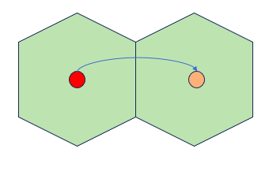
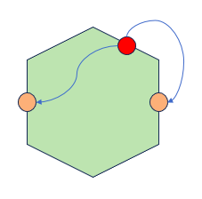
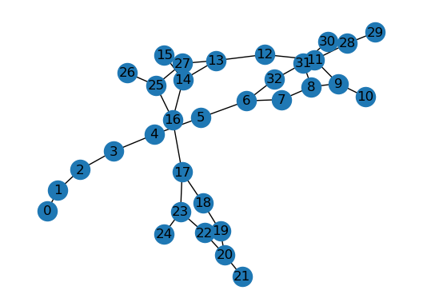

  

# Introduction

Graph Neural Networks (GNNs) have emerged as a powerful class of deep learning models for processing data that can be represented as graphs. Practical applications are starting to be seen in areas such as antibacterial discovery, physics simulations, fake news detections and many more. (add citations)
GNNs take as input a graph with node and edge features and compute a function that depends both on the features and the graph structure.
A popular subclass of GNNs for modeling graph-structured data are Message Passing GNNs (MP-GNNs), where nodes in the graph represent entities and edges represent relationships between them. This framework involves iteratively computing and passing messages between neighboring nodes, allowing them to update their internal state based on information from their neighbors. While this framework has been successful in a variety of applications, one limitation of MP-GNNs is their theoretical expressiveness bounded by the 1-WL test \cite{wl_test}, \cite{gnn_power}.

MP-GNNs can consider non-isomorphic graphs (shown in Figure 1) as equivalent and struggle to effectively capture the underlying relationships which may result in similar hidden representations for nodes in similar neighbourhoods, and therefore lead to poor expressive power of the network. The absence of global structural positional information of nodes decreases the representation power of MP-GNNs to distinguish simple graph symmetries. Specifically, this plays a significant role in tasks that heavily rely on the graph structure, notably in domains such as molecular tasks.


Various solutions have been introduced in order to overcome this shortcoming of MP-GNNs.
One approach amounts to including structural information in the initial node features, this is done by using positional encodings (PE) to augment the initial expressivity of the nodes \cite{wang2022equivariant}.
A novel framework has been proposed \cite{lspe}, following the integration of positional information to node features, in which GNNs are able to separately learn both structural and positional representations at the same time.

An alternative approach involves integrating topological information from the underlying graph. This is achieved by considering the graphs' structure as explicit features \cite{bodnar2021weisfeiler}. By considering any-dimensional cell (e.g. rings, edges), we create a more intricate neighbourhood structure with the consequence of being able to distinguish more cases of graph isophormism.
**Relevant work**
**Background**
**PE and Random Walk**
The expressive power of message-passing graph neural networks (MP-GNNs) is constrained by the Weisfeiler-Leman (WL) graph isomorphism test (\cite{wl_test}). This test makes use of a generated canonical form of each graph and compares the two. When these two canonical forms are not equivalent, it can be said that these two graphs are not equivalent. Despite being a powerful tool, the WL test has limitations, as it fails to detect certain graph substructures such as triangles or cycles of higher length, and cannot distinguish between non-isomorphic graphs with the same connectivity but different permutations of nodes (as shown in Figure 1). To some extent, this limitation can be overcome by creating more meaningful node embeddings that also consider their positional features \cite{wang2022equivariant}. 
In GNNs, nodes can be assigned an index positional encoding, however, this assignment is challenging due to the fact that there does not exist a canonical positioning of nodes in arbitrary graphs. 
This initialization can based on either the Laplacian Eigenvectors \cite{dwivedi2020benchmarking}, \cite{dwivedi2021generalization}, or probabilities defined by a random walk along the graph \cite{li2020distance}. \\
\textbf{Random Walk PE. }The Random Walk diffusion process defines a positional encoding for a graph by computing for each node $i$ a probability $p_{ik}$, the probability of taking $k$ random steps and landing on $i$ \cite{li2020distance}. These probabilities are used as a positional encoding for molecules, providing valuable topological information. **CHECK** someone check/change the following claim
By employing this initialization method, PEs capture the structural relationships and local connectivity patterns present in the graph. Random walk provides a unique node structural representation if each node has a unique k-hop topological neighborhood for a sufficiently large $k$.

A random walk is defined as the following equation:

   $$p_i^{RWPE} = [RW_{ii}, RW_{ii}^2, ..., RW_{ii}^k] \in  \mathbb{R}^k$$
where $RW = AD^{-1}$, with $A$ being the adjacency matrix and $D$ the degree matrix. (\cite{lspe}) differentiates this random walk method from the original proposed previously \cite{li2020distance}, by making use of a lower complexity method by only including the probability of a random-walk landing back on itself ($ii$) as opposed to the probability of a random walk landing on any $j$ node. This method can be used due to there being no sign invariance, something that a Laplacian positional encoding may encounter \cite{dwivedi2020benchmarking}.

Existing MP-GNNs that concatenate the PE with the input node features, follow the equation:
    $$
h_i^{\ell=0}=\mathrm{LL}_h\left(\left[\begin{array}{c}
h_i^{\text {in }} \\
p_i^{\text {in }}
\end{array}\right]\right)
$$

**LSPE.**  
Another approach, introduces the idea of learning positional representations alongside the structural representations. For this purpose, a novel framework called MPGNNs-LSPE is introduced. The update equations of this network are as follow:
$$
        h_i^{\ell+1}=f_h\left(\left[\begin{array}{c}
        h_i^{\ell} \\
        p_i^{\ell}
        \end{array}\right],\left\{\left[\begin{array}{c}
        h_j^{\ell} \\
        p_j^{\ell}
        \end{array}\right]\right\}_{j \in \mathcal{N}_i}, e_{i j}^{\ell}\right), h_i^{\ell+1}, h_i^{\ell} \in \mathbb{R}^d, $$
        \
        $$ e_{i j}^{\ell+1}=f_e\left(h_i^{\ell}, h_j^{\ell}, e_{i j}^{\ell}\right), e_{i j}^{\ell+1}, e_{i j}^{\ell} \in \mathbb{R}^d $$\
        $$ p_i^{\ell+1}=f_p\left(p_i^{\ell},\left\{p_j^{\ell}\right\}_{j \in \mathcal{N}_i}, e_{i j}^{\ell}\right), p_i^{\ell+1}, p_i^{\ell} \in \mathbb{R}^d
$$

**Explicit topological features**
**Simplicial Complexes (SC). **
 *Definition* \cite{nanda_simplex}. *Let V be a non-empty vertex set. A simplicial complex $\mathcal{K}$ is a collection of nonempty subsets of V that contains all the singleton subsets of V and is closed under the operation of taking subsets.* \
An element $\sigma \in \mathcal{K}$ is called a k-dimensional simplex.
In graph neural networks, simplicial complexes can be used to capture higher-order interactions among nodes in a graph. For instance, nodes are 0-simplices, edges are 1-simplices, triangles as 2-simplices, and so on until some predefined n-dimensional simplex. A set of all simplexes within a graph is called a complex. Simplexes are a generalization of a graph in which three edges can form a triangular face, four triangles can form a tetrahedral volume, and so on. Edges only connect pairs of nodes. By constructing simplicial complexes from a graph, higher-order neighborhoods of a node can be defined, and these can be used to improve the performance of the model in various applications. There are different approaches to incorporating simplicial complexes into GNNs, such as using them as additional input features or defining higher-order message-passing schemes. 


**Cellular Complexes (CC). **
GIN and GatedGCN architectures**
**GIN.** Graph isophormism network (GIN) is a neural architecture with the discriminative/representational power equal to the power of the WL test (\cite{gnn_power}, \cite{wl_test}). GIN updates the node representations with the following equation:
    $$h_v^{(k)}=\operatorname{MLP}^{(k)}\left(\left(1+\epsilon^{(k)}\right) \cdot h_v^{(k-1)}+\sum_{u \in \mathcal{N}(v)} h_u^{(k-1)}\right) .$$

More specifically, we use GIN-0 in our experiments, where $\epsilon$ is fixed to 0. As explained by the original authors, GIN-0 generalizes well and outperforms GIN-$\epsilon$ in test accuracy.

**Gated GCN.**
The Gated GCN architecture is a derivation of the graph convolutional network \cite{bresson2017residual} that makes use of gating mechanisms with the goal of capturing more complex graph relationships. While traditional GCNs aggregate information form neighboring nodes by taking the sum of some weighted features and applying some linear transform, the Gated GCN makes use of residual connections in order to incorporate relevant information from previous layers. There is also a ReLU nonlinearity used as a gating mechanism within this model, which is used to determine whether or not certain information passing through a layer is considered relevant.

$$
    \eta^{l+1} = \sigma(A^{l})
$$

# Contribution
(what we have written in methodology + experiments)
In this work, we propose a novel initialization method for positional encodings. Many existing works inject positional information into the input layer of the GNNs (\cite{dwivedi2021generalization}, \cite{kreuzer2021rethinking})), however, recent new results show the importance of PE for GNNs expressivity (\cite{srinivasan2020equivalence}, \cite{loukas2020graph}, \cite{murphy2019relational}). Section \ref{rwpe} will introduce the new initialized Random Walk initialization.


**Random Walk on cell complexes**

The initialization is done by considering the nearby nodes, we extend upon this idea by including different walking directions, which allow for a more complete representation of the underlying graph structure. 
We define three additional types of random walk on top of the traditional one (\cite{lspe}). Figure 2 provides a visual representation of this process.

```
|First Image|Second Image|
|:-:|:-:|
|||


# Experiments
|    Maximum Epochs    |  500 |
|:--------------------:|:----:|
|  Random Walk Length  |  20  |
| Start Learning Rate  | 1e-3 |
|   End Learning Rate  | 1e-6 |
|  Learning Rate Decay |  0.5 |
|       Patience       |  25  |
|      LSPE lambda     | 1e-1 |
|      LSPE alpha      |   1  |
We evaluate the impact of the random walk initialization by comparing three different networks, described in Section \ref{mpgnn_section} using Pytorch on ZINC molecular dataset (\cite{zinc}).
\subsection{Dataset}
\textbf{ZINC} dataset from the ZINC database (\cite{zinc}) contains about 250,000 molecular graphs with up to 38 heavy atoms. It is a graph regression dataset where the property to be predicted is its constrained solubility, a fundamental chemical property in molecular design (\cite{jin2019junction}).

A sample of this dataset is shown in Figure \ref{fig:zinc_sample} using the NetworkX package.


\\

 ## Models
### GIN

### GIN-PE


 ### MP-GNN-LSPE

# Results
After conducting some small-scale tests based on a sample training set of 10,000 molecules, the resulting validation
losses are shown below.

|    Model   |   PE Type   | Cellular in PE | Type of Random Walk                             | Training Loss | Validation Loss | Test Loss | Command                                                                    | Epoch |
|:----------:|:-----------:|----------------|-------------------------------------------------|---------------|-----------------|-----------|----------------------------------------------------------------------------|-------|
|     GIN    |     None    | No             | NA                                              | 0.052         | 0.463           | 0.466     | python -m src.train_GIN                                                    | 199   |
|     GIN    | Random Walk | Yes            | No                                              | 0.004         | 0.288           | 0.255     | python -m src.train_GIN --use_pe rw                                        | 499   |
|     GIN    | Random Walk | Yes            | Boundary/Co boundary                            | 0.002         | 0.295           | 0.261     | python -m src.train_GIN --use_pe ccrw                                      | 499   |
|     GIN    | Random Walk | Yes            | Upper adjacency                                 | 0.004         | 0.32            | 0.283     | python -m src.train_GIN --use_pe ccrw --traverse_type upper_adj            | 499   |
|     GIN    | Random Walk | Yes            | Lower adjacency                                 | 0.003         | 0.291           | 0.261     | python -m src.train_GIN --use_pe ccrw --traverse_type lower_adj            | 499   |
| GIN        | Random Walk | Yes            | Both Upper and lower adjacency                  | 0.003         | 0.284           | 0.259     | python -m src.train_GIN --use_pe ccrw --traverse_type upper_lower          | 499   |
|     GIN    | Random Walk | Yes            | Boundary/Co boundary, Upper and lower adjacency | 0.005         | 0.303           | 0.247     | python -m src.train_GIN --use_pe ccrw --traverse_type upper_lower_boundary | 499   |
|  GIN-LSPE  | Random Walk | No             | No                                              | 0.002         | 0.278           | 0.245     | python -m src.train_GIN_LSPE --use_pe rw                                   | 499   |
| MPGNN-LSPE | Random Walk | No             | No                                              | 1.03          | 0.850           | 0.844     | python -m src.train_MPGNN_LSPE --use_pe rw                                 | 499   |

# Conclusion

# References