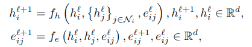
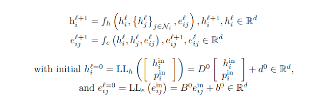
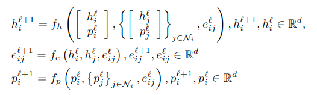
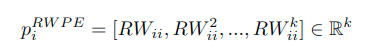

# Introduction
Graph Neural Networks (GNNs) have emerged as a powerful class of deep learning models for processing data that can be represented as graphs.
Message Passing GNNs (MP-GNNs) are a popular subclass of GNNs for modeling graph-structured data, where nodes in the graph represent entities
and edges represent relationships between them. This framework involves iteratively computing and passing messages between neighboring nodes, 
allowing them to update their internal state based on information from their neighbors. While this framework has been successful in a variety 
of applications, one limitation of MP-GNNs is their theoretical expressiveness bounded by the 1-WL test (\cite{wl_test}, \cite{gnn_power}).
MP-GNNs can consider non-isomorphic graphs as equivalent and struggle to effectively capture the underlying relationships which may result 
in poor performance. A novel framework has been proposed (\cite{dwivedi2022graph}), in which GNNs are able to learn both structural and positional 
representations at the same time.

\textbf{Contribution.} In this work, we propose a new method for initializing positional encodings by including cycles of any length, other than 
just nodes, which are able to capture higher-order structures \cite{bodnar2021weisfeiler}. Furthermore, we perform experiments on three different
types of Message Passing networks to evaluate the effectiveness of the inclusion of positional encodings.
# Background
\textbf{LSPE and RWPE.} 
The expressive power of message-passing graph neural networks (MP-GNNs) is constrained by the Weisfeiler-Leman (WL) graph 
isomorphism test (\cite{wl_test}). This test makes use of a generate canonical form of each graph and compares the two. 
When these two canonical forms are not equivalent, it can be said that these two graphs are not equivalent, even if they 
share the same adjacency matrix. Despite being a powerful tool, the WL test has limitations, as it fails to detect certain 
graph substructures such as triangles or cycles of higher length, and cannot distinguish between non-isomorphic graphs with 
the same connectivity but different permutations of nodes. The WL test is highly effective for small graphs, but its expressivity 
is limited for larger graphs and message-passing GNNs. (\cite{dwivedi2022graph}) propose a new architecture, called Learned 
Structural Positional Encodinds (LSPE), that enable the network to separately learn positional and structural representations for more expressivity. \\
The positional encodings are defined with Random Walk diffusion process. The random walk process is a process that defines a 
positional encoding for a graph by first taking an arbitrary start point. From this point, the random walk algorithm takes some 
$k$ steps to the surrounding nodes, via the edge connections. After these steps have been completed, it checks whether the walk has returned 
to its original node. This is conducted multiple times, and is used to define a probability based on how likely a random walk is to return to its start node. 
This is used as a positional encoding of a molecule. \\
\textbf{Simplicial Complexes (SC).} \label{simplex_section}
In graph neural networks, simplicial complexes can be used to capture higher-order interactions among nodes in a graph. 
A simplex can be a node (considered a 0-simplex), an edge (considered a 1-simplex), a triangle (considered a 2-simplex) 
and so on, up until some predefined n-dimensional simplex. A set of all simplexes within a graph is called a complex. 
Simplexes are a generalization of a graph in which three edges can form a triangular face, four triangles can form a 
tetrahedral volume, and so on. Edges only connect pairs of nodes. By constructing simplicial complexes from a graph, 
higher-order neighborhoods of a node can be defined, and these can be used to improve the performance of the model in 
various applications. There are different approaches to incorporating simplicial complexes into GNNs, such as using them 
as additional input features or defining higher-order message-passing schemes.
\textbf{Cellular Complexes (CC)}
A cellular complex is a generalization of an SC in which faces, volumes, etc are not restricted to triangles or tetrahedrons 
but may instead take any shape. Still, edges only connect pairs of nodes. Faces can involve more than three nodes, volumes of more 
than three faces, and so on. This flexibility endows CCs with greater expressivity than SCs (\cite{papillon2023architectures}). 
A cellular complex can include nodes, edges and simplices with 3 sides, as well as those with more than 3 sides. In this case, 
a maximum cycle size would also have to be defined. These can be made via a hierarchical combination of the simplexes described in 
\autoref{simplex_section} \cite{bodnar2021weisfeiler}.
# Methodology
In this work, we propose a novel initialization method for positional encodings. Many existing works inject positional information into the input layer of the GNNs (\cite{dwivedi2021generalization}, \cite{kreuzer2021rethinking})), however, recent new results show the importance of PE for GNNs expressivity (\cite{srinivasan2020equivalence}, \cite{loukas2020graph}, \cite{murphy2019relational}). Section \ref{mpgnn_section} will present the three different MP-GNN architectures employed in the experiments and Section \ref{rwpe} will introduce the new initialized Random Walk initialization.

## MP-GNN architectures \label{mpgnn_section}
### Standard MP-GNN.
We construct a basic MP-GNN architecture, which update equations are defined as:

the $f_h$ and $f_e$ are linear layers, and $\mathcal{N}_i}$ indicates the neighourhood of the node $i$. 
\\ \\
### Positional encoding MP-GNN. 
There are existing MP-GNNs that concatenate the positional encoding with the node features. Differently from LSPE-MP-GNNs (\cite{dwivedi2022graph}), the structural and positional information are merged together. 

\\ 
### MP-GNN-LSPE
The decoupling of positional and structural information is shown in the update equation that are defined as:

The novelty introduced by LSPE is the update of the positional representation, along with the concatenation with the node features. 

 ### Definition of initial PE - Random Walk \label{rwpe} 
The traditional RWPE is defined as the landing probability of a node $i$ to itself (\cite{li2020distance}). RWPE is related to the problem of graph isomorphism and higher-order node interactions. The random walk methodology can be formally defined as shown in \autoref{RW_eq}.

The $RW$ indicates a random walk function $RW = AD^{-1}$. (\cite{dwivedi2022graph}) differentiates this random walk method from the original proposed previously \cite{li2020distance}, by making use of a lower complexity method by only including the probability of a random-walk landing back on itself ($ii$) as opposed to the probability of a random walk landing on any $j$ node. This method can be used due to there being no sign invariance, something that a Laplacian positional encoding may encounter \cite{dwivedi2020benchmarking}.
The initialization is done by considering the nearby nodes, we extend upon this idea by including all other cycles up to length $k$, which allows for a more complete representation of the underlying graph structure. 

# Experiments
We evaluate the impact of the random walk initialization by comparing three different networks, described in Section \ref{mpgnn_section} using Pytorch on ZINC molecular dataset (\cite{zinc}).
\subsection{Dataset}
\textbf{ZINC} dataset from the ZINC database (\cite{zinc}) contains about 250,000 molecular graphs with up to 38 heavy atoms. It is a graph regression dataset where the property to be predicted is its constrained solubility, a fundamental chemical property in molecular design (\cite{jin2019junction}).

A sample of this dataset is shown in Figure \ref{fig:zinc_sample} using the NetworkX package.

\\

 ## Models
 ### MP-GNN
The MP-GNN network makes use of the same setup as defined within the original LSPE paper to deliver a proper comparison between our implementation and that of the original LSPE implementation. Two experiments were conducted, where one mad use of a 10,000 training and 1,000 validation sample of the original ZINC dataset, while the other employed the entirety of the dataset. This network did not make use of the 

 ### MP-GNN-PE

 ### MP-GNN-LSPE

# Results

# Conclusion

# References