# Introduction

Graph Neural Networks (GNNs) have emerged as a powerful class of deep learning models for processing data that can be represented as graphs. GNNs have been applied to numerous domains ranging from quantum chemistry, recommender systems, antibacterial discovery, physics simulations, fake news detections, knowledge graphs, and natural language processing (Taub et al., 2023; Gladstone et al., 2023; Phan et al., 2023; Yasunaga et al., 2021; Wu et al., 2023).

A popular subclass of GNNs for modeling graph-structured data are Message Passing GNNs (MP-GNNs) (Shen et al., 2020), where nodes in the graph represent entities and edges represent relationships between them. This framework involves iteratively computing and passing messages between neighboring nodes, allowing them to update their internal state based on information from their neighbors. While this framework has been successful in a variety of applications, one limitation of MP-GNNs is their theoretical expressiveness bounded by the 1-WL test (Morris and Ritzert, 2021; Xu et al., 2019). MP-GNNs can consider non-isomorphic graphs (shown in Figure 1) as equivalent and struggle to effectively capture the underlying relationships, which may result in similar hidden representations for nodes in similar neighborhoods and therefore lead to poor expressive power of the network. The absence of global structural positional information of nodes decreases the representation power of MP-GNNs to distinguish simple graph symmetries. Specifically, this plays a significant role in tasks that heavily rely on the graph structure, notably in domains such as molecular tasks.

Various solutions have been introduced to overcome this shortcoming of MP-GNNs. One approach amounts to including structural information in the initial node features, done by using positional encodings (PE) to augment the initial expressivity of the nodes (Wang et al., 2022). A novel framework has been proposed (Dwivedi et al., 2022), following the integration of positional information to node features, in which GNNs are able to separately learn both structural and positional representations at the same time.
An alternative approach involves integrating topological information from the underlying graph. This is achieved by considering the graph's structure as explicit features (Bodnar et al., 2021). By considering any-dimensional cell (e.g., rings, edges), a more intricate neighborhood structure is created, allowing for the distinction of more cases of graph isomorphism.

    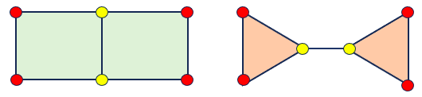

    <em>Figure 1.</em>Examples of non-isomorphic graphs that cannot be distinguished by 1-WL.

### Contribution.
In this work, we explore the effect of more meaningful structural encodings in the MP-GNN GIN (Xu et al., 2019) and Gated 
GCN (Bresson et al., 2018) models by combining the two aforementioned methods. First, we introduce a novel way to initialize 
the positional encodings that include more topological information, by including edges and cycles of lengths up to a point, 
extending beyond individual nodes. This inclusion will enable the network to capture higher-order structures more effectively. 
Second, we extend the original GIN and Gated GCN models with LSPE, to make use of these more detailed positional encodings 
and better capture the structural information of the graph within the training portion of the models.
Our results indicate that the use of cellular complexes within the positional encodings of the graphs improves the loss
values of the vanilla GCN and GIN architectures as they provide a more detailed encoding of graphs by learning from the 
cellular complex random walk positional embeddings. This suggests that using a cellular random walk making use of 
cellular complexes is more effective than a simple random walk making use of only the node features. We additionally saw better
results in the GIN architecture when LSPE was implemented, which was in line with the results of Dwivedi et al. (2022).

### Relevant work
In this section, we provide a brief overview of relevant publications and research directions.

**Graph isomorphism tests and theoretical expressivity.** The limitations of the standard message passing framework were discussed in Xu et al. (2019), where the equivalence between the framework and the Weisfeiler-Lehman (WL) test was demonstrated. To enhance expressivity within the message passing paradigm, Graph Isomorphism Networks (GIN) were introduced, which replicate the aggregation process of the WL algorithm. Morris et al. (2021) proposed a novel aggregation scheme operating on higher-order node relations, further enhancing the power of the WL test. This approach enables the construction of a more robust graph isomorphism test and corresponding models. In a similar vein, Bodnar et al. (2021) defined a message passing scheme for cellular complexes, leading to the development of a corresponding message-passing model.

**Topological deep learning and cellular complexes.** Several studies have explored the utilization of information from higher-order node relations by modifying the set of objects involved in message exchanges (Bodnar et al., 2021) or the message passing procedure itself (You et al., 2019). These approaches are dependent on the choice of the topological domain, such as graphs or hypergraphs (Papillon et al., 2023). Cellular complexes, introduced by Hansen et al. (2019), are topological spaces that incorporate both hierarchical and set-type relations. Bodnar et al. (2021) demonstrated that every graph can naturally be lifted to a cellular complex and proposed a novel message passing scheme for such objects. The resulting model, Cell Isomorphism Network (CIN), significantly improves the expressivity of standard message-passing GNNs and achieves state-of-the-art performance on the ZINC dataset.

**Positional encodings.** The approaches discussed in the previous section require significant engineering effort due to the non-standard input space and exhibit high computational complexity (Papillon et al., 2023). As an alternative solution, Xu et al. (2019) suggested enhancing the node features of graphs with positional information derived from the graph Laplacian's eigenvectors to address the performance limitations caused by insufficient model expressivity. Li et al. (2020) introduced a method for computing positional encodings using statistics of random walks over the input graph, inspired by the PageRank algorithm. Finally, Dwivedi et al. (2022) presented a framework for learnable positional embeddings as a trade-off between increased complexity and state-of-the-art performance, which we utilized in our experiments.

### Background

**PE and Random Walk**
The expressive power of message-passing graph neural networks (MP-GNNs) is constrained by the Weisfeiler-Leman (WL) graph isomorphism test (Morris and Ritzert, 2021). This test makes use of a generated canonical form of each graph and compares the two. When these two canonical forms are not equivalent, it can be said that these two graphs are not equivalent. Despite being a powerful tool, the WL test has limitations, as it fails to detect certain graph substructures such as triangles or cycles of higher length, and cannot distinguish between non-isomorphic graphs with the same connectivity but different permutations of nodes (as shown in Figure 1). To some extent, this limitation can be overcome by creating more meaningful node embeddings that also consider their positional features (Wang et al., 2022).

In GNNs, nodes can be assigned an index positional encoding; however, this assignment is challenging due to the fact that there does not exist a canonical positioning of nodes in arbitrary graphs. This initialization can be based on either the Laplacian Eigenvectors (Dwivedi et al., 2020; Dwivedi et al., 2021) or probabilities defined by a random walk along the graph (Li et al., 2020).

**Random Walk PE.** The Random Walk diffusion process defines a positional encoding for a graph by computing for each node $i$ a probability $p_{ik}$, the probability of taking $k$ random steps and landing on $i$ (Li et al., 2020). These probabilities are used as a positional encoding for molecules, providing valuable positional information. By employing this initialization method, PEs capture the structural relationships and local connectivity patterns present in the graph. The random walk provides a unique node structural representation if each node has a unique k-hop topological neighborhood for a sufficiently large $k$.

A random walk is defined in the following equation.

$$p_i^{RWPE} = [RW_{ii}, RW_{ii}^2, ..., RW_{ii}^k] \in  \mathbb{R}^k$$
where $RW = AD^{-1}$, with $A$ being the adjacency matrix and $D$ the degree matrix. Dwivedi et al., 2022 differentiates this random walk method from the one originally proposed by Li et al. (2020) by making use of a lower complexity method that only includes the probability of a random walk landing back on itself ($ii$), as opposed to the probability of a random walk landing on any $j$ node. This method can be used due to the absence of sign invariance, which may pose a challenge for a Laplacian positional encoding (Dwivedi et al., 2020).
Existing MP-GNNs that concatenate the PE with the input node features, follow the equation:

    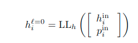

    <em>Equation 1.</em>

**LSPE.** Another approach, introduces the idea of learning positional representations alongside structural representations. For this purpose, a novel framework called MPGNNs-LSPE is introduced. The updated equations of this network are as follows:

    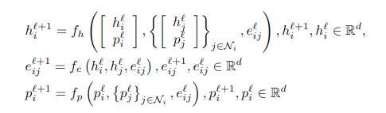

    <em>Equation 2.</em>

**Explicit topological features**

**Simplicial Complexes (SC).** *Definition* (Nanda, 2021). <em> Let V be a non-empty vertex set. A simplicial complex K is a collection of nonempty subsets of V that contains all the singleton subsets of V and is closed under the operation of taking subsets. </em> \
An element $\sigma \in \mathcal{K}$ is called a k-dimensional simplex.
In graph neural networks, simplicial complexes can be used to capture higher-order interactions among nodes in a graph. For instance, nodes are 0-simplices, edges are 1-simplices, triangles as 2-simplices, and so on until some predefined n-dimensional simplex. A set of all simplexes within a graph is called a complex. Simplexes are a generalization of a graph in which three edges can form a triangular face, four triangles can form a tetrahedral volume, and so on. Edges only connect pairs of nodes. By constructing simplicial complexes from a graph, higher-order neighborhoods of a node can be defined, and these can be used to improve the performance of the model in various applications. There are different approaches to incorporating simplicial complexes into GNNs, such as using them as additional input features or defining higher-order message-passing schemes. 

**Cellular Complexes (CC).**
A cellular complex is a generalization of a simplicial complex in which faces, volumes, etc., are not restricted to triangles or tetrahedrons but may instead take any shape. This flexibility endows cellular complexes (CCs) with greater expressivity than simplicial complexes (SCs) (Papillon et al., 2023). A cell complex is constructed with a hierarchical gluing procedure. It can start with a set of vertices and then edges, but this can be generalized by gluing a closed two-dimensional disk to any simple cycle within the graph. By doing so, a graph can be viewed as a 2D regular cell complex. This process, which involves attaching the disks to the edges or cycles present in the graph, expands its dimensionality and creates a more comprehensive cellular structure. The resulting complex incorporates both the original graph and the added two-dimensional cells, allowing for a richer representation that can be exploited for a richer message-passing architecture (Bodnar et al., 2021).

For a cell complex $X$ and a cell $\sigma \in X$, we define cell complex adjacencies. 
The lower adjacent cells are defined as the cells of the same dimension as $\sigma$ that share a lower dimensional cell on their boundary. On the other hand, the upper adjacent cells are the cells of the same dimension as $\sigma$ that rest on the boundary of the same higher-dimensional cells as $\sigma$. 
The boundary adjacent cells are defined as the lower-dimensional cells on the boundary of $\sigma$. In the case of an edge, its boundary adjacent cells are its vertices.

**GIN and GatedGCN architectures**
**GIN.** The Graph Isomorphism Network (GIN) is a neural architecture that has discriminative and representational power equal to the power of the Weisfeiler-Lehman (WL) test (Xu et al., 2019; Morris and Ritzert, 2021). GIN updates the node representations using the following equation:

    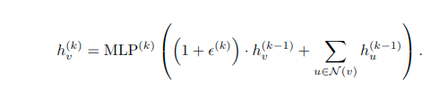

    <em>Equation 3.</em>

More specifically, we use GIN-0 in our experiments, where epsilon is fixed to 0. As explained by the original authors, GIN-0 generalizes well and outperforms GIN-epsilon in test accuracy.

    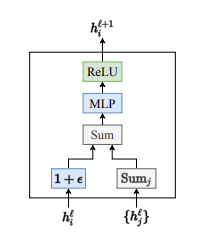

    <em>Figure 2.</em> A visual representation of a GIN layer. (Dwivedi et al., 2020)

**Gated GCN.**
The Gated Graph Convolutional Network (GCN) architecture is a derivation of the graph convolutional network proposed by Bresson et al. (2017) that incorporates gating mechanisms to capture more complex graph relationships. While traditional GCNs aggregate information from neighboring nodes by taking the sum of some weighted features and applying some linear transform, the Gated GCN makes use of residual connections in order to incorporate relevant information from previous layers. There is also a sigmoid non-linearity used as a gating mechanism within this model, along with a ReLU, which is used to determine whether or not certain information passing through a layer is considered relevant. Below is the equation for such a network, where the matrices $A,B,C$ signify MLPs within each of the Gated GCN layers.

    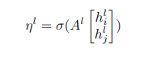

    <em>Equation 4.</em>

    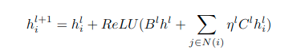

    <em>Equation 5.</em>

A visual representation of a single GatedGCn layer is shown below.

    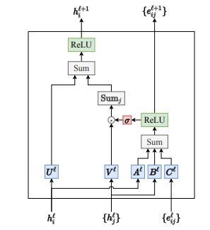

    <em>Figure 3.</em> A gated GCN layer. (Dwivedi et al., 2020)

# Methodology
In this work, we propose a novel initialization method for positional encodings. Many existing works inject positional information into the input layer of the Graph Neural Networks (GNNs) (Dwivedi et al., 2021; Kreuzer et al., 2021). However, recent results have highlighted the significance of positional encodings for enhancing the expressivity of GNNs (Srinivasan et al., 2020; Loukas et al., 2020; Murphy et al., 2019). The following section will introduce the new initialized Random Walk initialization.

### Random Walk on cell complexes

The initialization is done by considering the nearby nodes, we extend upon this idea by including different walking directions, which allow for a more complete representation of the underlying graph structure. 
We define three additional types of random walk on top of the traditional one (Dwivedi et al., 2022). The figures below provide a visual representation of this process.

**N-Cellular-RW.** In the initialization process we employ random walks on the upper and lower adjacent cells, defined in the background section. To establish connectivity, we construct the upper adjacency index which maps k-dimensional cells to k-dimensional cells and provides the (k+1)-cell through which these cells are connected. Similarly, we construct lower adjacency index maps that capture the lower adjacency relationships. For instance, in the case of edges, we can jump from one edge to the other if they have a cell in common. For vertices, this is possible if there is an edge in common, while for cells we do not have this as there is no higher dimensional shared cell. 

**B-Cellular-RW.** This random walk is initialized exclusively Similarly to the upper/lower adjacency index matrix, we construct a boundary index matrix, where for vertices the values are zeroes as they do not have a boundary.

**NB-Cellular RW.** Lastly, we combine the two aforementioned random walks. These two methods are combined by allowing the random walk process to step both up and down the dimensions of the cellular complexes. This means that a walk has the option to either step between cellular complexes in the same dimension, effectively creating a shortcut over other lower or higher dimensional complexes. A walk could also take an extended route, and make use of multiple different dimensions when mapping out the neighboring features. This process has the ability to create a more detailed positional embedding of the surrounding graph strcuture at some computational expense, as this process creates an even more connected graph than the previous two mentioned methods.

    <em>Figure 4.</em> Lower adjacent random walk. The cell labeled in red is able to walk to the other cell as they share a lower dimensional cell in their boundary, the edge.

<em>Figure 5.</em> Boundary adjacent random walk. The edge labeled in red is able to walk to the other edges through the nodes.

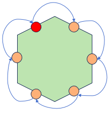

 
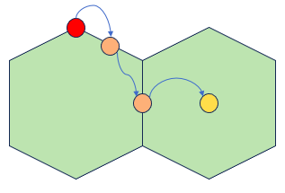

    <em>Figure 6.</em> Combined cellular random walk.

### Inclusion of LSPE into GIN and GatedGCN architectures

The implementation of the LSPE into both the GIN and GatedGCN architectures required some modifications to the underlying models, as LSPE requires positional embeddings to be passed through the model as well. Edge features also had to be concatenated with the incoming sending and receiving node features.

**GIN-LSPE.**
Note that the matrices $A, B, C, D$ are MLPs. We can see that there are several residual connections throughout this model architecture, incorporating past nodal and positional information into the layers during updates. All incoming graph attributes are initially passed through an embedding layer. This includes both the node attributes $h$ and positional node embeddings $p$. 

    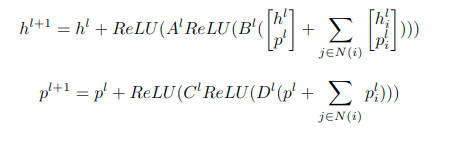

    <em>Equation 6.</em>

**Gated GCN-LSPE.**
Note that all input in the below equations should initially be passed through an embedding layer that encodes positional information of all attributes used within the layers of this model. This includes the edge attributes $e$, and both the sending and receiving nodes, $h_i$ and $h_j$ resepctively. The layers $A,B,C,D,E$ are MLPs.

    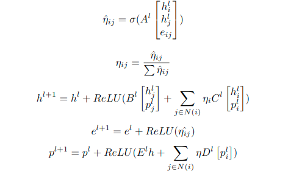

    <em>Equation 7.</em>

# Experiments
We evaluate the impact of the inclusion of topological information in the random walk initialization by carrying out experiments with different settings. For all experiments, we employ the Graph Isomorphism Network (GIN) as our base model, as it provides a relatively simple architecture to evaluate the effectiveness of our LSPE and cellular complex random walk method. Additionally, we utilize the Gated Graph Convolutional Network (GatedGCN) as another baseline model, following the original LSPE paper by Xu et al. (2019) and Bresson et al. (2018). Both networks are implemented using PyTorch and evaluated on the ZINC molecular dataset (Xu et al., 2019; ZINC).An ablation study was conducted, with both the GIN and Gated GCN architectures, where the effects of the LSPE implementation and varying cellular random walk implementations making use of upper, lower, and boundary adjacency matrices were observed. The settings are presented below.

### Dataset
The ZINC dataset used in this work is sourced from the ZINC database (ZINC) and consists of molecular structures with up to 38 heavy atoms. Following the methodology outlined in Dwivedi et al. (2022), a subset of 12,000 molecules is selected for experimentation. The ZINC dataset is a graph regression dataset, where the task is to predict the constrained solubility of each molecule. Constrained solubility is a fundamental chemical property in molecular design (Jin et al., 2019).

A sample of this dataset is shown in Figure 6 below using the NetworkX package.

 

<em>Figure 7.</em> A sample molecule from the ZINC dataset.

Each of the nodes within these graphs has its own attribute, as do the edges connecting said nodes. To carry on the cellular setting experiments we add upper and lower adjacency indexes, boundary indexes, and cell features.

### Experimental settings
Table 1 presents the hyperparameters used in all the experiments. For the GIN and GIN LSPE models, we make use of a hidden dimension of 78, and 16 layers, while for Gated GCN and Gated GCN LSPE, the hidden dimension per layer is 60, while the number of layers used is 16. The total number of trainable parameters for the standard GCN and GIN models was roughly $505,000$, while for GIN and GCN models make use of LSPE it was roughly $532,000$. The batch size used for all models is 128. All models used were extremely small, requiring only 2.128 megabytes of storage.

|    Maximum Epochs    |  200 |
|:--------------------:|:----:|
|  Random Walk Length  |  20  |
| Start Learning Rate  | 1e-3 |
|   End Learning Rate  | 1e-5 |
|  Learning Rate Decay |  0.5 |
|       Patience       |  20  |
|      LSPE lambda     | 1e-1 |
|      LSPE alpha      |   1  |

# Results
The results of all our experiments on different instances of Random Walk along with performance without using PE are presented in the table below.

|    |    Model |     PE type | Cellular in PE |                             Type of Random walk | Train L1 loss | Val L1 loss |   Test L1 loss | Improvement of Test Loss over Vanilla Model | Command                                                                                                      |
|----|---------:|------------:|---------------:|------------------------------------------------:|----------:|--------:|-----------:|-------------------------------:|--------------------------------------------------------------------------------------------------------------|
|  1 |      GIN |        None |              - |                                                 |     0.100 |   0.435 |   0.422900 |                                | python -m src.train                                                                                          |
|  2 |      GIN | Random Walk |             No |                                              No |     0.003 |   0.251 |   0.227071 |                         46.31% | python -m src.train --use_pe rw                                                                              |
|  3 |      GIN | Random Walk |            Yes |                            Boundary/Co boundary |     0.002 |   0.241 |   0.205413 |                         51.43% | python -m src.train --use_pe ccrw --traverse_type boundary                                                   |
|  4 |      GIN | Random Walk |            Yes |                                 Upper adjacency |     0.003 |   0.246 |   0.220600 |                         47.84% | python -m src.train --model gin --use_pe ccrw --traverse_type upper_adj                                      |
|  5 |      GIN | Random Walk |            Yes |                                 Lower adjacency |     0.002 |   0.316 |   0.314015 |                         25.75% | python -m src.train --use_pe ccrw --traverse_type lower_adj                                                  |
|  6 |      GIN | Random Walk |            Yes |                  Both Upper and lower adjacency |     0.004 |   0.303 |   0.257367 |                         39.14% | python -m src.train --model gin --use_pe ccrw --traverse_type upper_lower                                    |
|  7 |      GIN | Random Walk |            Yes | Boundary/Co boundary, Upper and lower adjacency |     0.002 |   0.259 |   0.218300 |                         48.38% | python -m src.train_GIN --use_pe ccrw --traverse_type upper_lower_boundary                                   |
|  8 | GIN-LSPE | Random Walk |             no |                                         normal  |     0.003 |   0.242 |   0.195422 |                                | python -m src.train --use_pe rw --learnable_pe True                                                          |
|  9 | GIN-LSPE | Random Walk |            Yes |                                 Upper adjacency |     0.002 |   0.252 |   0.204869 |                         -4.83% | python -m src.train --use_pe ccrw --learnable_pe True  --traverse_type upper_adj                             |
| 10 | GIN-LSPE | Random Walk |            Yes |                                 Lower adjacency |     0.005 |   0.310 |   0.301796 |                        -54.43% | python -m src.train --use_pe ccrw --learnable_pe True  --traverse_type lower_adj                             |
| 11 | GIN-LSPE | Random Walk |            Yes |                            Boundary/Co boundary |     0.004 |   0.241 |   0.201649 |                         -3.19% | python -m src.train --use_pe ccrw --learnable_pe True  --traverse_type boundary                              |
| 12 | GIN-LSPE | Random Walk |            Yes |                  Both Upper and lower adjacency |     0.005 |   0.297 |   0.251322 |                        -28.60% | python -m src.train --use_pe ccrw --learnable_pe True  --traverse_type upper_lower                           |
| 13 | GIN-LSPE | Random Walk |            Yes | Boundary/Co boundary, Upper and lower adjacency |     0.003 |   0.249 |   0.203753 |                         -4.26% | python -m src.train --model gin --use_pe ccrw --learnable_pe True --traverse_type upper_lower_boundary       |
| 14 |      GCN |        None |              - |                                            None |   0.00175 |  0.3118 |   0.281576 |                                | python  -m src.train --model gated_gcn                                                                       |
| 15 |      GCN | Random Walk |             No |                                 Upper adjacency |  0.003048 | 0.20908 |   0.186355 |                         33.82% | python -m src.train --model gated_gcn --use_pe rw                                                            |
| 16 |      GCN | Random Walk |            Yes | Boundary/Co boundary, Upper and lower adjacency |  0.001823 | 0.20805 | 0.17915397 |                         36.37% | python -m src.train --model gated_gcn --use_pe ccrw --traverse_type upper_lower_boundary                     |
| 17 |      GCN | Random Walk |            Yes |                            Boundary/Co boundary |   0.00425 |   0.189 |     0.1785 |                         36.61% | python -m src.train --model gated_gcn --use_pe ccrw --traverse_type boundary                                 |
| 18 |      GCN | Random Walk |            Yes |                                 Upper adjacency |     0.007 | 0.20148 |    0.18258 |                         35.16% | python -m src.train --model gated_gcn --use_pe ccrw --traverse_type upper_adj                                |
| 19 | GCN-LSPE | Random Walk |             No |                                         Normal  |  0.002066 |  0.1563 |   0.134818 |                                | python -m src.train --model gated_gcn --use_pe rw --learnable_pe True                                        |
| 20 | GCN-LSPE | Random Walk |            Yes | Boundary/Co boundary, Upper and lower adjacency |     0.002 |  0.1271 |   0.113833 |                         15.57% | python -m src.train --model gated_gcn --use_pe ccrw --learnable_pe True --traverse_type upper_lower_boundary |
| 21 | GCN-LSPE | Random Walk |            Yes |                                 Upper adjacency |     0.003 |   0.153 |   0.125357 |                          7.02% | python -m src.train --model gated_gcn --use_pe ccrw --learnable_pe True --traverse_type upper_adj            |
| 22 | GCN-LSPE | Random Walk |            Yes |                                 Lower adjacency |     0.003 |   0.225 |   0.229040 |                        -69.89% | python -m src.train --model gated_gcn --use_pe ccrw --learnable_pe True --traverse_type lower_adj            |
| 23 | GCN-LSPE | Random Walk |            Yes |                                        Boundary |     0.004 |   0.157 |   0.134979 |                         -0.12% | python -m src.train --model gated_gcn --use_pe ccrw --learnable_pe True --traverse_type boundary             |

**LSPE improves the performance of GIN and Gated GCN.** The inclusion of LSPE improves the loss of the GIN architecture. 
This is in line with the results of the original paper (Dwivedi et al. (2022)). We see a significant improvement of 53.79\% 
over the vanilla GIN architecture without positional encoding when basic random walk and LSPE are included. The inclusion of more topological information provides a more 
robust positional embedding of the graph structure.
 The use of LSPE in the gatedGCN model also resulted in a 52.1\% decrease in the loss. 

**Cellular RW improves GatedGCN.** The performance of the GatedGCN model with LSPE improves by 15.57\% when cellular random walks 
are included in the positional encoding process. The same can be said for the Gated GCN model that does not employ the 
LSPE method, which sees an improvement of 36.61\%. When comparing the results of the GatedGCN model without LSPE with and without any type
of cellular random walk, we see that any type of this random walk improves the performance of the model. This is in line with 
our original assumptions.

**Random walk improves the baseline GIN.** The inclusion of a random walk positional encoding improves the performance 
of the GIN architecture across all loss categories. Although the GIN architecture is not explicitly mentioned in Dwivedi 
et al. (2022), 
they do conclude that positional encodings improve the results of GNN architectures. Our results fall in line with this 
conclusion as well. Additionally, we see a slight improvement over the GIN model with random walk when cellular random walk is implemented instead
but only when the traverse type is a boundary, or when it includes all types of adjacency matrices. Similarly, this can 
also be seen within the GIN model that makes use of LSPE.

**Cellular random walks with boundary/co-boundary, upper and lower adjacency matrices improve cellular walk positional 
encodings within GIN models.** From this set of experiments, we can note that the inclusion of all types of graph complex 
traversing results in the lowest loss values. This is because a more detailed encoding of the node positions is created, 
as it allows for the random walk to develop more concise relations between the complexes.

**When using Cellular Random Walk on the original GIN and Gated GCN architectures, the boundary traversing method performed best.** 
When comparing all types of traversing methods used, the implementation making use of the boundary/co-boundary adjacency 
matrices showed the biggest improvement over the original modes without any positional encodings. This improvement comes from
the fact that these matrices may strike a balance between the properties of the upper and lower adjacency matrices. Additionally,
These boundary matrices may also provide the right amount of detailed information about the graphs, without forcing the model to 
overfit on too much data, which would explain the higher loss values that the combination of upper, lower and boundary adjacency
matrices yield Bodnar et al., (2021a).

# Conclusion

Within this project, we made modifications to existing graph neural network architectures with the objective of improving 
their performance on the ZINC dataset. Specifically, we modified a Graph Isomorphism Network (GIN) and a Gated Graph Convolutional 
Network (Gated GCN) to incorporate learned structural and positional encodings using the cellular complex random walk implementation 
proposed by Dwivedi et al. (2022). This implementation, which originally utilized node and edge attributes, was extended to include 
cellular complexes, resulting in a more comprehensive representation known as a "cellular complex random walk." By applying the random 
walk process to these two models, we demonstrated that the use of cellular random walks can enhance the performance of GIN and Gated GCN 
architectures. Furthermore, we showed that we were able to incorporate the cellular complex random walk into GNN models that 
made use of LSPE successfully. With this combination, we were able to outperform the original GIN and Gated GCN models. We were 
also able to outperform these models even when the made use of the original random walk positional encodings.

### Future work. 
Due to time constraints, our experiments were limited to the ZINC dataset. However, future extensions could involve
utilizing non-molecular graph datasets such as IMDB-MULTI, IDBM-BINARY (Morris et al., 2020), and CIFAR10, following 
the approach outlined in Dwivedi et al. (2022). Additionally, it would be valuable to explore the application of LSPE 
with cellular complex random walks in a Convolutional Isomorphism Network (CIN) architecture, as this architecture has
shown state-of-the-art performance when used with larger cell structures (Bodnar et al., 2021). Additionally, our method allows for the 
computation of all positional encodings at once, and is easily portable to the CIN architecture.
# References
[1] Cristian Bodnar et al. “Weisfeiler and lehman go cellular: Cw networks”. In: Advances in Neural
Information Processing Systems 34 (2021), pp. 2625–2640.

[2] Cristian Bodnar et al. Weisfeiler and Lehman Go Topological: Message Passing Simplicial
Networks. 2021. arXiv: 2103.03212 [cs.LG].
    
[3] Xavier Bresson and Thomas Laurent. “Residual gated graph convnets”. In: arXiv preprint
arXiv:1711.07553 (2017).
    
[4] Xavier Bresson and Thomas Laurent. Residual Gated Graph ConvNets. 2018. arXiv: 1711.07553
[cs.LG].
    
[5] Vijay Prakash Dwivedi and Xavier Bresson. A Generalization of Transformer Networks to Graphs.
2021. arXiv: 2012.09699 [cs.LG].
    
[6] Vijay Prakash Dwivedi et al. “Benchmarking graph neural networks”. In: (2020).
    
[7] Vijay Prakash Dwivedi et al. Graph Neural Networks with Learnable Structural and Positional
Representations. 2022. arXiv: 2110.07875 [cs.LG].
    
[8] Rini Jasmine Gladstone et al. “GNN-based physics solver for time-independent PDEs”. In: arXiv
preprint arXiv:2303.15681 (2023).
    
[9] John Irwin et al. “ZINC: A Free Tool to Discover Chemistry for Biology”. In: Journal of chemical
information and modeling 52 (May 2012). doi: 10.1021/ci3001277.
    
[10] Wengong Jin, Regina Barzilay, and Tommi Jaakkola. Junction Tree Variational Autoencoder for
Molecular Graph Generation. 2019. arXiv: 1802.04364 [cs.LG].
    
[11] Devin Kreuzer et al. Rethinking Graph Transformers with Spectral Attention. 2021. arXiv: 2106.
03893 [cs.LG].
    
[12] Pan Li et al. Distance Encoding: Design Provably More Powerful Neural Networks for Graph
Representation Learning. 2020. arXiv: 2009.00142 [cs.LG].
    
[13] Andreas Loukas. What graph neural networks cannot learn: depth vs width. 2020. arXiv: 1907.
03199 [cs.LG].
    
[14] Christopher Morris et al. “Tudataset: A collection of benchmark datasets for learning with
graphs”. In: arXiv preprint arXiv:2007.08663 (2020).
    
[15] Christopher Morris et al. “Weisfeiler and Leman Go Neural: Higher-order Graph Neural Networks”.
In: CoRR abs/1810.02244 (2018). arXiv: 1810.02244. url: http://arxiv.org/abs/1810.02244.
    
[16] Ryan L. Murphy et al. Relational Pooling for Graph Representations. 2019. arXiv: 1903.02541
[cs.LG].
    
[17] Vidit Nanda. Computational algebraic topology lecture notes. 2021.
    
[18] Mathilde Papillon et al. Architectures of Topological Deep Learning: A Survey on Topological
Neural Networks. 2023. arXiv: 2304.10031 [cs.LG].
    
[19] Huyen Trang Phan, Ngoc Thanh Nguyen, and Dosam Hwang. “Fake news detection: A survey of
graph neural network methods”. In: Applied Soft Computing (2023), p. 110235.
    
[20] Yifei Shen et al. Graph Neural Networks for Scalable Radio Resource Management: Architecture
Design and Theoretical Analysis. 2020. arXiv: 2007.07632 [cs.IT].
    
[21] Balasubramaniam Srinivasan and Bruno Ribeiro. On the Equivalence between Positional Node
Embeddings and Structural Graph Representations. 2020. arXiv: 1910.00452 [cs.LG].
    
[22] Ronen Taub, Tanya Wasserman, and Yonatan Savir. “Symbiotic Message Passing Model for Trans-
fer Learning between Anti-Fungal and Anti-Bacterial Domains”. In: arXiv preprint arXiv:2304.07017
(2023).
    
[23] Haorui Wang et al. Equivariant and Stable Positional Encoding for More Powerful Graph Neural
Networks. 2022. arXiv: 2203.00199 [cs.LG].
    
[24] Lingfei Wu et al. “Graph neural networks for natural language processing: A survey”. In:
Foundations and Trends® in Machine Learning 16.2 (2023), pp. 119–328.
    
[25] Keyulu Xu et al. “How Powerful are Graph Neural Networks?” In: CoRR abs/1810.00826 (2018).
arXiv: 1810.00826. url: http://arxiv.org/abs/1810.00826.
    
[26] Michihiro Yasunaga et al. “QA-GNN: Reasoning with language models and knowledge graphs for
question answering”. In: arXiv preprint arXiv:2104.06378 (2021).
    
# Appendix 
## Appendix A: MPGNN Architectures
### Standard MPGNN
 We construct a basic MP-GNN architecture, which update equations are defined as:

    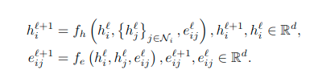

    <em>Equation 8.</em>

the $f_h$ and $f_e$ are linear layers, and $\mathcal{N}_i$ indicates the neighborhood of the node $i$. 
### MPGNN-PE
There are existing MP-GNNs that concatenate the positional
encoding with the node features. Differently from LSPE-MP-GNNs (Dwivedi et al., 2022), the structural
and positional information are merged together.

    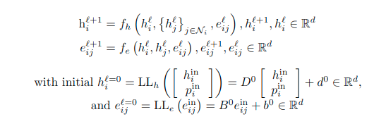

    <em>Equation 9.</em>

### MPGNN-LSPE

The decoupling of positional and structural information is shown in the update
equation that is defined as:

    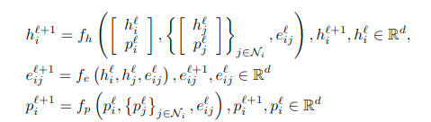

    <em>Equation 10.</em>

The novelty introduced by LSPE is the update of the positional representation, along with the
concatenation with the node features.
## Appendix B: Computational Resources
In order to train our models for our set of experiments, we needed to make use of several different
computational resources. These included a T5 GPU, a 1080Ti, as well as a 3060. These were not used in conjunction with one another.
